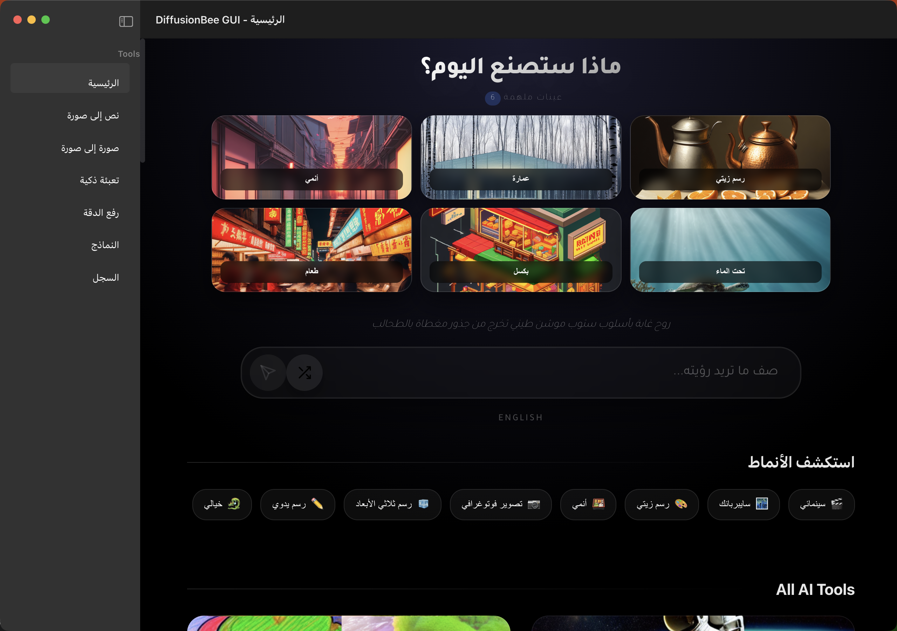
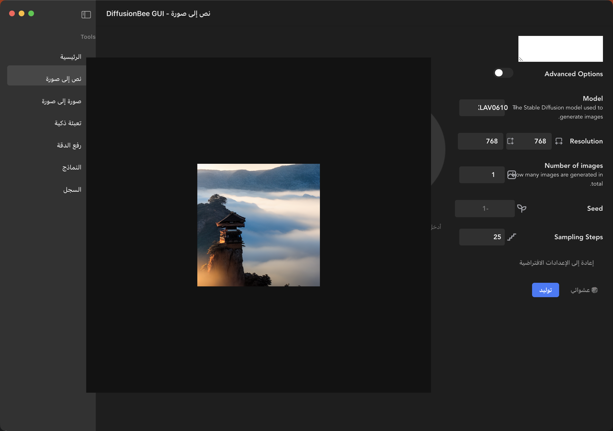
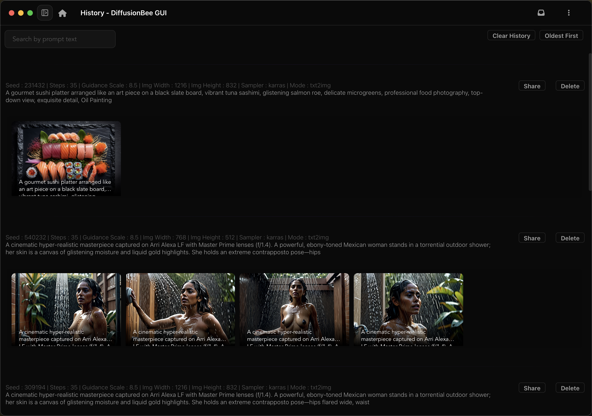
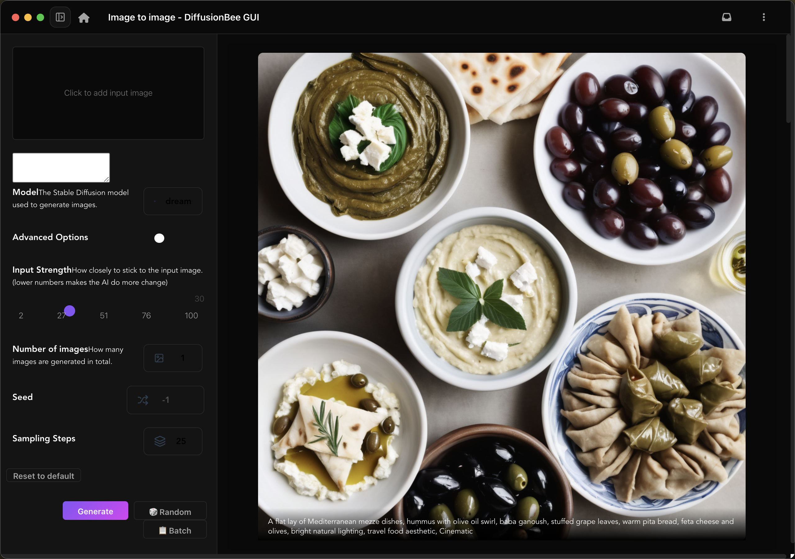
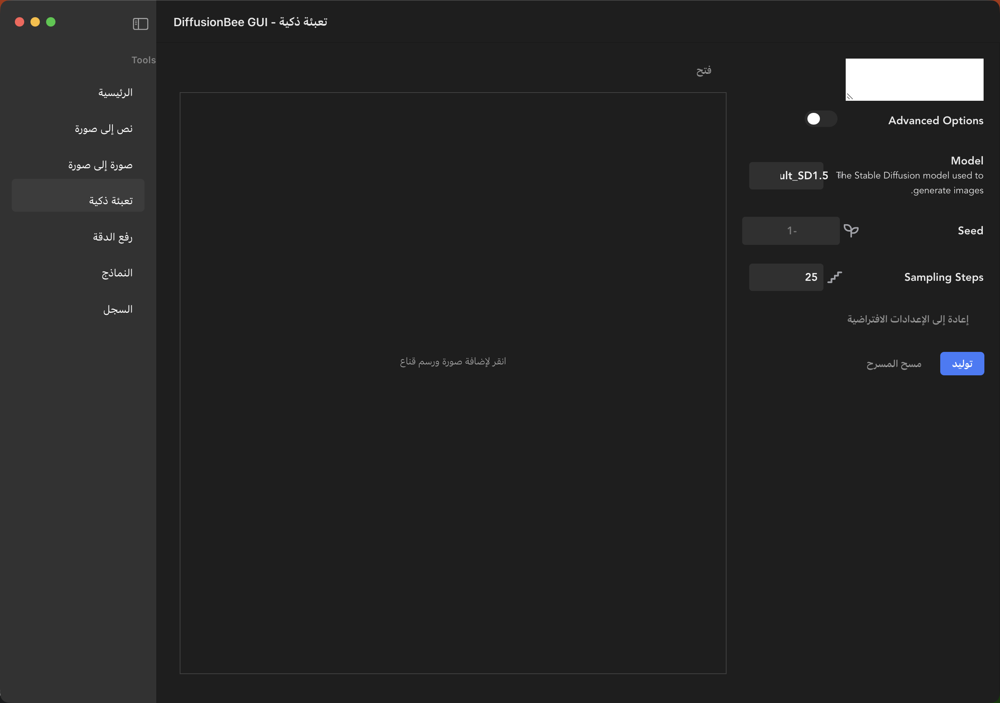
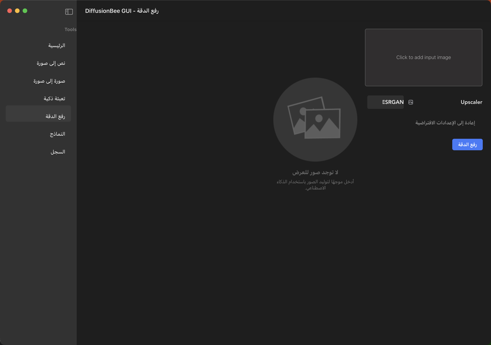
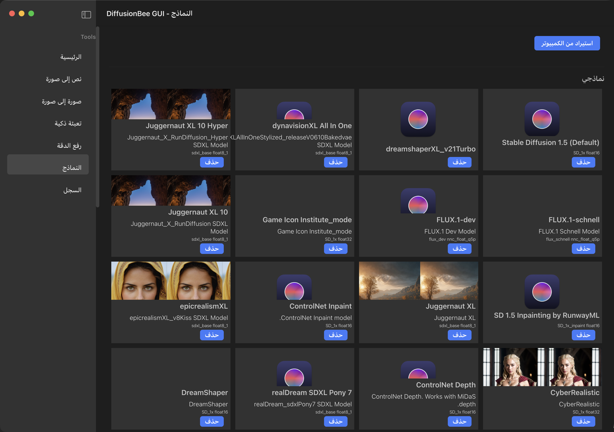

# DiffusionBee - Stable Diffusion GUI App for macOS

[](https://twitter.com/divamgupta)

DiffusionBee is the easiest way to run Stable Diffusion locally on your Intel / Apple Silicon Mac. Comes with a one-click installer. No dependencies or technical knowledge needed.

* Runs locally on your computer — no data is sent to the cloud (other than requests to download model weights, unless you choose to upload an image).
* If you like DiffusionBee, consider checking [Liner.ai](https://Liner.ai), a one-click tool to train machine learning models.

---

Download at [diffusionbee.com](https://diffusionbee.com/)

For prompt ideas visit [arthub.ai](https://arthub.ai)

Join the Discord server: [discord.gg/t6rC5RaJQn](https://discord.gg/t6rC5RaJQn)

---

## Features

* Full data privacy — nothing is sent to the cloud (unless you choose to upload an image)
* Clean, easy-to-use UI with one-click installer
* **New homepage** — chat-style prompt input, model chips, style presets, and history carousel
* Text to image, image to image, inpainting, outpainting, upscaling
* Supported models: SD 1.x, SD 2.x, SDXL, FLUX, inpainting, ControlNet, LoRA
* Download and import models from the app
* Generation history with search and sorting
* Optimized for Apple Silicon (M1/M2/M3)
* Negative prompts and advanced generation options
* **Arabic language support** with Tajawal font and RTL layout
* **DreamBooth Training UI** (frontend ready; backend integration coming soon)

## Screenshots

### Homepage (new welcome screen)



The welcome carousel uses six locally generated sample images bundled under `electron_app/src/assets/welcome/`.

### Text to image (UI)



### Generation output (history + standalone sample)

Real backend output — not an empty UI placeholder:




### Image to image



### Inpainting



### Upscaler



### Models



---

## Requirements

* Mac with Intel or Apple Silicon CPU
* For Intel: macOS 12.3.1 or later
* For Apple Silicon: macOS 11.0.0 or later

**Development requirements:**

| Component | Version |
|-----------|---------|
| Node.js | ≥ 26 |
| npm | ≥ 10 |
| Python (backend venv) | 3.11 (`backends/stable_diffusion/venv311`) |

---

## Running from source

### 1. Clone the repository

```bash
git clone https://github.com/divamgupta/diffusionbee-stable-diffusion-ui
cd diffusionbee-stable-diffusion-ui
```

### 2. Install frontend dependencies

```bash
cd electron_app
npm install
```

### 3. Set up the Python backend

The Electron app expects a populated virtualenv at `backends/stable_diffusion/venv311`.

```bash
cd backends/stable_diffusion
python3.11 -m venv venv311
source venv311/bin/activate
pip install -r requirements.txt
```

> **Note:** The legacy docs mention a conda env with Python 3.9.10. Current development and test scripts use `venv311` with Python 3.11, which is what the Electron bridge prefers.

### 4. Run the app

From the repo root:

```bash
npm run serve
```

Or from `electron_app/`:

```bash
npm run electron:serve
```

To run without DevTools during UI capture or testing:

```bash
IS_TEST=1 npm run electron:serve
```

### 5. Build the UI bundle

```bash
cd electron_app
npm run build:ui      # Demo UI entry (browser-only, no backend)
npm run build         # Production renderer build
```

### 6. Build the full Electron app (macOS)

```bash
npm run build
```

This packages the Python backend from `backends/` into the app bundle.

---

## Testing

### Lint

```bash
cd electron_app && npm run lint
```

### Backend smoke test

Verifies the Python backend starts, accepts a generation command, and writes an output image:

```bash
backends/stable_diffusion/venv311/bin/python3 test_generation.py
```

### Full backend harness

Runs a longer generation test with progress monitoring:

```bash
backends/stable_diffusion/venv311/bin/python3 test_backend.py
```

**Prerequisites for tests:**

* `backends/stable_diffusion/venv311` with dependencies installed
* At least one `.tdict` model in `~/.diffusionbee/downloaded_assets/` or `~/.diffusionbee/imported_models/`

**Verified on this machine (2026-06-18):**

| Test | Result |
|------|--------|
| `npm run lint` | Pass |
| `npm run build:ui` | Pass |
| `test_generation.py` | Pass — cat image generated in ~41s |
| `test_backend.py` | Pass — phoenix image generated in ~46s |
| `npm run electron:serve` | App launches, backend connects |

---

## Installing models from HuggingFace

Use the provided installer script to download and convert HuggingFace models to DiffusionBee's `.tdict` format:

```bash
export HF_TOKEN=your_huggingface_api_token

python3 install_hf_model.py \
  --model-id runwayml/stable-diffusion-v1-5 \
  --filename v1-5-pruned-emaonly.ckpt \
  --output-name stable-diffusion-v1-5
```

Restart DiffusionBee or refresh the models list after installation.

---

## Architecture (quick reference)

```
Electron main (background.js)
  └── bridge.js → spawns diffusionbee_backend.py (stdin/stdout)
Renderer (Vue 2.7)
  ├── App.vue — shell, splash, model onboarding
  ├── PagesRouter.vue — lazy-loaded pages (Homepage, Txt2Img, …)
  ├── StableDiffusion.vue — generation state machine
  └── py_vue_bridge.js — IPC to Python (`b2py` / `sdbk` protocol)
```

| Path | Purpose |
|------|---------|
| `electron_app/src/` | Vue 2 frontend |
| `backends/stable_diffusion/` | Python inference backend |
| `backends/model_converter/` | `.ckpt`/`.safetensors` → `.tdict` conversion |
| `~/.diffusionbee/` | Runtime data (models, images, settings) |

See [docs/DOCUMENTATION.md](docs/DOCUMENTATION.md) and [docs/Running_from_source.md](docs/Running_from_source.md) for more detail.

---

## Capturing screenshots (macOS)

With the Electron app running, use the full documentation pipeline (generates a real image, captures UI, composites output into txt2img, verifies):

```bash
./scripts/ensure_doc_screenshots.sh
```

This **fails** if any required screenshot lacks real image content. Individual steps:

```bash
python3 scripts/prepare_doc_screenshots.py --generate   # backend output → sample-generation.png
./scripts/capture_screenshots.sh                        # UI captures (needs Electron + cliclick)
python3 scripts/compose_txt2img_screenshot.py           # merge sample into txt2img UI shot
python3 scripts/verify_doc_screenshots.py              # strict check
```

Screenshots are saved to `docs/screenshots/`. Requires [cliclick](https://www.florianreuter.de/cliclick/) (`brew install cliclick`).

---

## Building the Windows installer

The Windows NSIS installer is built on a Windows host (or in CI) because
PyInstaller cannot cross-compile the Python backend executable from macOS.

### Option 1: GitHub Actions (recommended)

Push to `master` and the `.github/workflows/windows-build.yml` job will:

1. Set up Python 3.11 and install backend dependencies.
2. Build `diffusionbee_backend.exe` with PyInstaller.
3. Download the Real-ESRGAN Windows binary.
4. Bundle the default Stable Diffusion 1.5 model (so the app is ready to generate).
5. Build the Vue frontend and produce an NSIS `.exe` installer.
6. Upload the installer as a workflow artifact named `windows-installer`.

### Option 2: AppVeyor (no Windows machine or GitHub billing needed)

If GitHub Actions is unavailable, use the included `appveyor.yml`:

1. Go to https://ci.appveyor.com/projects/new and sign in with GitHub.
2. Select the `aldoyh/diffusionbee-sd-ui` repository.
3. AppVeyor will automatically pick up `appveyor.yml` and build the NSIS installer on every push to `master`.
4. Download the `.exe` from the build artifacts.

### Option 3: Local Windows build

On a Windows machine with Node.js 20+, Python 3.11, and PyInstaller installed:

```bash
# Full pipeline (downloads the default model if not cached)
node scripts/build-windows.js

# Skip bundling the default model for a smaller installer
node scripts/build-windows.js --no-models
```

The resulting installer is written to `electron_app/dist_electron/*.exe`.

### Option 4: Manual steps

```bash
# 1. Install backend dependencies
pip install -r backends/stable_diffusion/requirements.txt

# 2. Build backend executable
cd backends/stable_diffusion
pyinstaller diffusionbee_backend.spec

# 3. Download Real-ESRGAN Windows release into backends/stable_diffusion/realesrgan-release

# 4. Stage backend + Real-ESRGAN
cd ../..
npm run prepare:backend:win

# 5. Bundle default model
npm run bundle:models -- --download

# 6. Build installer
npm run build:win
```

---

## License

Stable Diffusion is released under the [CreativeML OpenRAIL-M license](https://github.com/CompVis/stable-diffusion/blob/main/LICENSE). DiffusionBee is a GUI wrapper on top of Stable Diffusion, so the same terms apply to outputs.

## References

1. [CompVis/stable-diffusion](https://github.com/CompVis/stable-diffusion)
2. [madebyollin/maple-diffusion](https://github.com/madebyollin/maple-diffusion)
3. [divamgupta/stable-diffusion-tensorflow](https://github.com/divamgupta/stable-diffusion-tensorflow)
4. [liuliu/swift-diffusion](https://github.com/liuliu/swift-diffusion) (big thanks to Liu Liu)
5. [huggingface/diffusers](https://github.com/huggingface/diffusers)

===
  <small>DESIGNED & DEVELOPED WITH LOVE ❤️ IN BAHRAIN 🇧🇭 BY HASAN ALDOY @aldoyh - <a href="https://doy.tech">doy.tech</a></small>
===